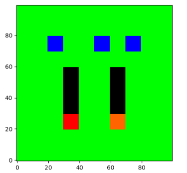
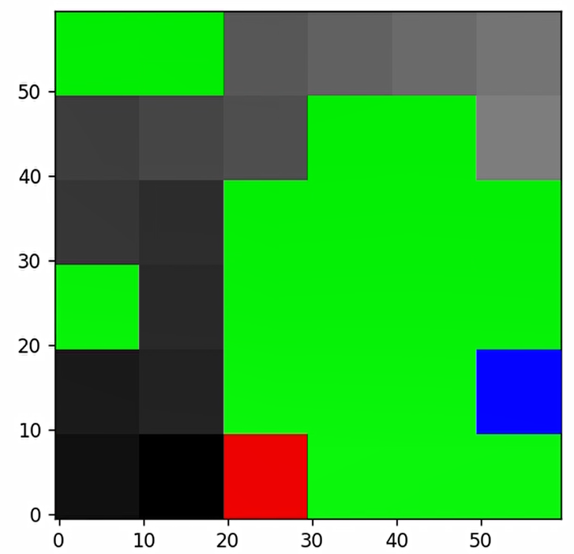
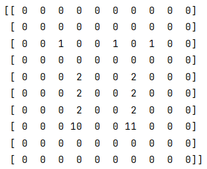
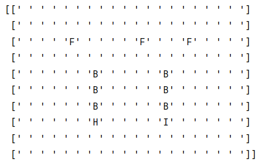
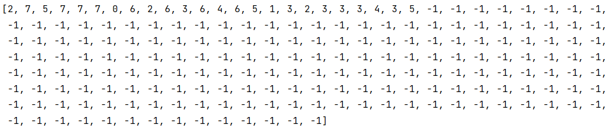
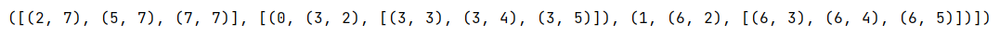
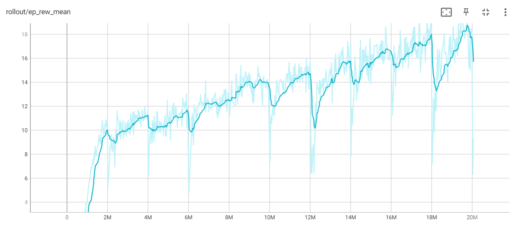
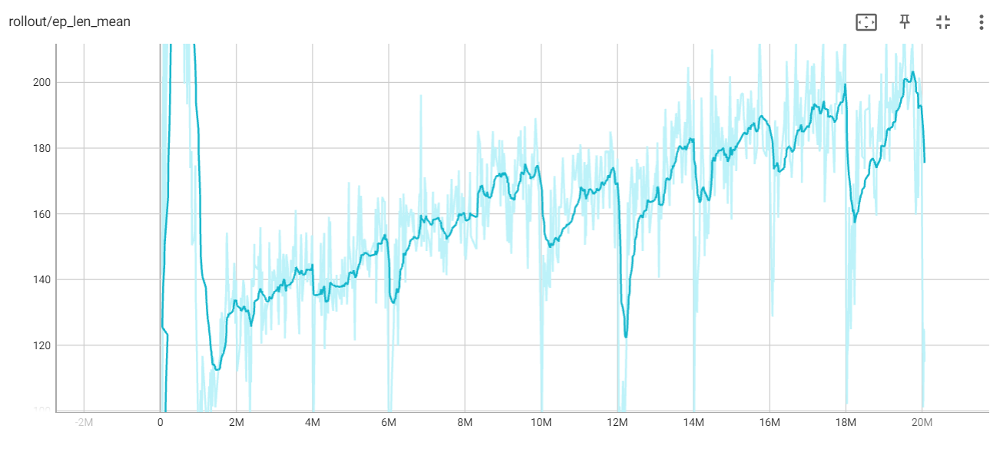

# gymsnake &emsp; <0_0>~~~~~~~~^-^-^




## Description
gymsnake is a multiplayer version of the classic snake game. It can also be played as single-player game. 
It is made as an Gymnasium environment to allow easy connection of your AI agent using reinforcement learning (RL) 
libraries. 

## Installing gymsnake
1. Clone this repository
2. Install dependencies:
   * `conda install pytorch torchvision torchaudio pytorch-cuda=11.7 -c pytorch -c nvidia`
   * `conda install gymnasium numpy matplotlib stable-baselines3[extra] tensorboard pip -c conda-forge`
3. Navigate to the cloned repository
4. As you will be making changes to the source code of gymsnake, we'll install it as an so-called "editable package"
   in the conda environment with command `pip install -e .`

   **Note**, if you make changes to the gymsnake source code, and you use Jupyter notebook, you need to restart 
   the Jupyter notebook kernel to pick up the changes you made in gymsnake. Reason is that Jupyter notebook does not 
   re-import packages if the kernel is not restarted, so it will not see the source code changes.  If you use an IDE
   like PyCharm or Visual Studio Code, you don't have this problem.

## Using gymsnake
After installation, you can create a gymsnake environment in your agent as follows:
   
```
 import gymnasium as gym
 import gymsnake  # performs the registration of snake-v1 with gymnasium
 env = gym.make('snake-v1', disable_env_checker=True)  # creates an environment and wraps it with gymnasium.wrappers.time_limit.TimeLimit
 
 # if you want multiplayer; otherwise remove this statement and use default values
 env.env.n_snakes = 2  # note the double env, caused by the wrapping!
 
 observation = env.reset()
 env.render()
 ```


## Game parameters
Just above you saw how to change the number of snakes in the game. There are other parameters that you can tweak.
If you don't tweak them, the default values are used. The default values are also shown in the table below. 

```
grid_size=(6, 6)                 # tuple containing (width, height) of grid
body_start_length=1              # body length of every snake at game start
n_snakes=1                       # number of snakes at game start
n_foods=1                        # number of food units on the grid at any given time
random_food_init=False           # if false, food units are placed at the same location at every game start,
                                   otherwise they are placed at random locations;
                                   during the game, new food is always placed at random locations
obs_type=ObsType.DIGIT_GRID      # the representation of the observation passed to the RL agent. Four types are supported:
                                   ObsType.DIGIT_GRID 
                                   ObsType.LETTER_GRID (handy as human-readable format, but most RL libs don't accept it)
                                   ObsType.PIXEL_GRID
                                   ObsType.COORDS (in a representation suitable for machine learing)
rendering_obs=ObsType.PIXEL_GRID # the representation of the observation used for rendering. The same four types are
                                   supported. ObsType.COORDS will be in a human-readable representation
head_representations=((10, 11), ('H', 'I'), (0, 100))  # identity of each snake head to make it recognizable for the AI.
                                                         The first tuple is for ObsType.DIGIT_GRID. The second tuple
                                                         is for ObsType.LETTER_GRID. The third tuple is for
                                                         ObsType.PIXEL_GRID and denotes the amount of green in RGB.
                                                         '0' will give RGB (255,0,0) which is a red snake head.
                                                         '100' will give RGB (255,100,0) which is an orange snake head.
unicolor_body=True               # if all body parts have the same color, for a long curled-up snake, it cannot
                                   determine, based on the current state, which squares become empty behind the snake
                                   when the game proceeds. This means that a snake with uni-colored body parts does not
                                   have the Markov property, so optimal behavior cannot be guaranteed. On the other
                                   hand, with unicolor_body=False, every body part of a snake has a different
                                   identification, which has as consequence that the number of possible states heavily
                                   increases, slowing down learning.
use_bots=False                   # with use_bots=False, in case of multiplayer snake, a list of actions, one for every 
                                   snake, must be passed in step() and a list of rewards, one for every 
                                   snake, is returned. 
                                   With use_bots=True, in case of multiplayer snake, only one action
                                   for the learning snake must be passed in step(), whereas the other actions are 
                                   provided by bots. Only the reward of the learning snake is returned. The rewards of
                                   the bots are discarded. The bots use the last saved model to predict their actions
                                   (check folder path) and use Action.DOWN if no model has yet been saved. All bots use
                                   the same model. After a complete learning run, a new model will be saved (that will
                                   be used by the bots in the next learning run). use_bots=True cannot be used for
                                   single-player snake.
```

**Important**: if you want your trained snake agents competing against each other, it is important to use the same
game options. Therefore, it's best to use the default values as much as possible. Only if you want to use advanced
techniques, like staged learning, you might want to tweak other parameters. See the section 'Competition Mechanics' 
for details.

## State representations
As mentioned above, four state representations are supported. This section shows an example of each representation
for the same game state.

ObsType.DIGIT_GRID



ObsType.LETTER_GRID



ObsType.PIXEL_GRID


ObsType.COORDS (machine learning representation)



ObsType.COORDS (human-readable representation)



Some source code to explain `ObsType.COORDS`:
```
print('foods', snake_env.obs[0])
for snake in snake_env.obs[1]:
    print('snake id', snake[0])
    print('snake head', snake[1])
    print('snake body', snake[2])
```
and the output:
```
foods [(2, 7), (5, 7), (7, 7)]
snake id 0
snake head (3, 2)
snake body [(3, 3), (3, 4), (3, 5)]
snake id 1
snake head (6, 2)
snake body [(6, 3), (6, 4), (6, 5)]
```

## Game mechanics
### Single-player mechanics:
* a snake moves in every step; not moving is not an option
* stepping backwards causes the snake to die as it collides with itself
* if food is eaten, new food appears at a random, empty square
* running off the grid causes the snake to die
* if the snake dies, done becomes True
* actions can be a single value or as list; if actions is a single value, then rewards is a single value; if actions 
  is a list then rewards is a list. actions can be of type `int` or type `Action`
* +1 reward if snake eats food, -1 reward if snake dies, 0 reward otherwise. Note that the snake has no incentive
  to eat fast (only the discount factor helps the snake te become efficient)!
* the game is stopped after 400 steps (only enforced if gymsnake is used via `env = gym.make('snake-v1', disable_env_checker=True)`!)

### Additional multiplayer mechanics:
* in bot-mode (self.use_bots = True):
  * for each step you should provide one action, used by the AI-snake
  * for each step a one reward is returned, the reward of the AI-snake. Consequence is that the AI-snake does not
    know anything about the rewards of other snakes
  * done becomes true if the AI-snake is dead or if all squares are occupied
  * if there's no trained model on disk, bots will always take `Action.DOWN`. If there's a trained model on disk,
    all bots use the same model. This does not mean that all bots take the same action, as they each have a different
    position on the grid. 
  * The model on disk that the bots use is, of course, for a specific algorithm and specific snake settings. If you
    change algorithm or snake settings like grid size, the model is not valid anymore and an error message will be
    given. Note that the name of the model on disk and the algorithm used (PPO from Stable-Baselines3) 
    are hard-coded in `snake_env.py`, in case you want to adapt it.
* in competition-mode (self.use_bots = False):
  * for each step you should provide a list of actions, one for every snake
  * for each step a list of rewards is returned, one for every snake
  * done becomes true if all snakes are dead or if all squares are occupied
  * the longest snake will win, not the snake that lives the longest. This is not so much a mechanic, but a consequence.
    Snakes only try to be as long as possible. They don't have a concept of 'time' or the concept 'longer than the
    others'. One way to become as long as possible is to have the other snakes killed quickly.
* general behavior:
  * if a snake runs into another snake, it dies
  * the snake actions passed in a step are performed one by one; to have fair play, this is done in random order.
    Example: if snakes 'H' and 'I' move to the same empty square, sometimes 'H' will die and sometimes 'I'
  * if a snake dies, it is immediately taken off the board
  * the actions and rewards lists remain the same length even if snakes die; the provided action values for dead snakes 
    are ignored; the rewards for dead snakes have value 0
  * at start the snakes are placed on the grid from left to right, but the snakes are initialized in random order. So 
    sometimes snake 'H' will be initialized on the left side of the grid, sometimes on the right side of the grid. 
    So the AI learns to start sometimes on the left side and sometimes on the right side.
    This avoids the following unfair situation during competition: if two AI-snakes 'H' and 'I' were both trained with
    start position on the left side, 
    when they compete against each other, the snake that gets the start position on the right side has a disadvantage, 
    because it's initialized in a way it has never trained for.  

### Competition mechanics:
* All competitors should train their AI with the same game parameters (all of them!, not only grid size); otherwise 
  during competition some of the AI-snakes see a grid that they have never seen before. 
* There's one exception to this above rule and that is the snake head representations. First two examples to make this
  clear. Then two solutions are given.
  * Example 1: let's assume you have been training with 3 snakes and your AI always had snake head 'H', whereas the two
    other bots had snake head 'I' and 'J. This means that the AI
    has learned that when 'H' moves to a food location, it receives a reward. Therefore, during competition the AI should 
    also get the snake with snake head 'H', otherwise it will perform poorly.
  * Example 2: if the AI was trained with snake head 'H' and bots 'I' and 'J', it can only compete with other AI's 
    with head 'I' and 'J'. So best option to divide the students in two groups, the 'H's and the 'I's. For fun an 
    8-snake competition can be done.
  * Solution 1: if you're going to compete with three snakes, agree beforehand who get snake head `110`, who get snake
    head `111` and who `112`. Use the parameter `head_representations` to train your snake with the agreed snake head.
  * Solution 2: you all train with the same head representation, but during competition each AI agent gets its own
    version of the observation of the environment. This code is an example of how you can do this for the 2-snake
    case for ObsType.DIGIT_GRID:
 ```
  def swap(obs0):
      # clone to avoid changing the original observation
      obs1 = obs0.copy()
      temp_value = -1
      obs1[obs1 == head_representation0] = temp_value
      obs1[obs1 == head_representation1] = head_representation0
      obs1[obs1 == temp_value] = head_representation1
      return obs1
```
* The COORD_OBS state representation needs special attention, as it is an ordered representation: the snakes are
  identified by their order, not by their head representation. Therefore, during competition, you need to reorder
  to have your snake at the first position, as was the case during training

## Gymnasium crash course
gymsnake is an Gymnasium environment. This means that if you program your AI agent, you use the Gymnasium interface
to communicate with the environment. This section describes the most important methods of the Gymnasium interface. Gymnasium
is a fork of the OpenAI Gym interface.

* `env.reset()` initializes the environment and should be the first method to invoke after environment creation. It
  returns the observation of the state of the just initialized environment.
* `env.step(actions)` performs an action for each snake and collects their rewards. Also checks if the game has 
  finished. `actions` is a list with actions corresponding to each snake, including dead snakes. The actions of the 
  dead snakes are ignored. `step()` returns `obs, rewards, done, info`. `obs` is the observation of the environment 
  state. `rewards` is a list of rewards including dead snakes. Rewards for dead snakes are 0. `done` tells the game has 
  finished. `info` provides additional textual info.
* `env.render()` shows the observation of the environment state. The way it shows it depends on the `ObsType` with which 
  the environment has been created. With `env.render(frame_speed=1)` the observations are shown at a speed of 
  one per second.

## Training metrics with Tensorboard

The two Tensorboard graphs show 'mean 100 episode reward' and 'mean 100 episode length' of multiplayer snake. It shows 
10 training 
runs of 2000000 steps each. In every training run the AI-snake uses the model saved at the end of the previous run and 
therefore continues learning where it finished the previous run. The bots (n_snakes is 2) also use the model saved at 
the end of the previous run, but, of course, only playing not learning.

Interesting to note:
* The mean episode rewards continues to increase. This is an indication that the AI-snake learns. If the mean episode
  reward doesn't increase there no reason to continue training.
* At that start of each of the 10 training runs the AI-snake must adapt to the bot which just got a new model and 
  therefore mean episode rewards drop temporarily.
* The mean episode length continues to increase. This is an indication that the snake learns not to kill itself, 
  although it does not necessarily mean that the snake is effective in finding food, as it might go around in circles.
* A game is stopped after 400 steps. This is very important to interrupt snakes that go around in circles. You could
  otherwise lose hours of training time. It is very important to check the graph with mean episode length to see if the
  snake often hits the 400-step limit. If this is the case, there are two possibilities, which you should really be
  aware of: the AI-snake does not learn,
  or it is learning very well, but it needs more than 400 steps to finish an episode. This is for example the case if
  you use a large grid. The later possibility is of course very unfortunate.





### Installation of Tensorboard
* Anaconda prompt> `conda install tensorboard -c conda_forge`
* In the anaconda command prompt, go to the folder from where your start traning sessions, using `cd`.
* Start Tensorboard by typing `tensorboard --logdir tensorboard_logs/` in the anaconda command prompt.


## Problems 

### Snake rendering within Jupyter notebook
Graphically rendering your snake using `render()` from within a Jupyter notebook does not work. On the internet 
proposed solutions, like inserting `%matplotlib notebook` and then `%matplotlib inline` before calling `render()` 
don't solve the problem. Two solutions that are satisfactory:
* run the snake from the command line `powershell> python your_snake_agent.py`. This provides smooth graphical rendering.
* use an IDE like PyCharm or Visual Studio Code. Pycharm renders as separate graphical images. Not smooth, but okay.

Inspired by [this repo](https://github.com/grantsrb/Gym-Snake).
